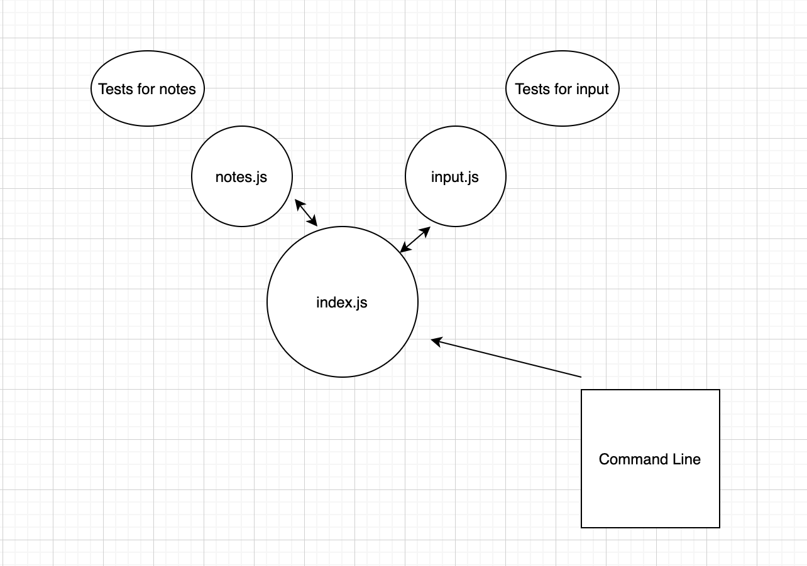

LAB - Class 01
Project: Notesy
Author: Sara

Links and Resources
Worked with Spencer and Kevin for lab01 10/12/20 in remo
worked with Michael E and Kevin for lab02 10/13/20 in remo
worked with Michael E, Kevin, and Spencer for lab03 10/14/20 in remo

docs for mongoose - https://mongoosejs.com/docs/
notes on minimist - https://www.npmjs.com/package/minimist
notes for using spyOn in Jest - https://stephencharlesweiss.com/jest-testing-spyon-consoles/

ci/cd (GitHub Actions)
back-end server url (when applicable)
front-end application (when applicable)
Setup
.env requirements 

PORT - 3000
MONGODB_URI - URL to the running mongo instance/db

How to initialize/run your application
npm start

How to use:
Enter a command and note in the command line to update a note object 

Tests
node test

UML

